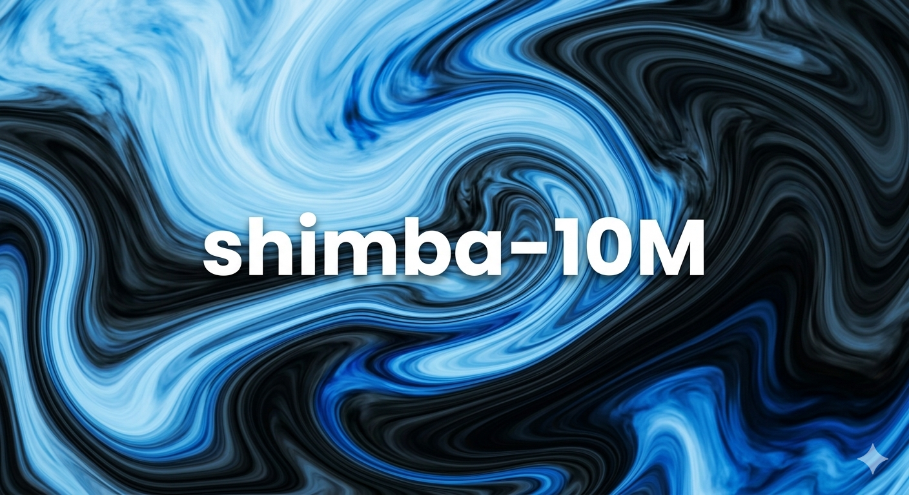

# shimba-10M

A **10.7M-parameter decoder-only Transformer** language model, trained from
scratch with [Shimba-LLM-Training](https://github.com/Shimba-crypto/Shimba-LLM-Training).
No base model, no distilled weights — every parameter learned from text.

## Architecture

| Setting | Value |
|---|---|
| Layers / heads / hidden | 6 / 6 / 384 |
| Context window | 256 tokens |
| Tokenizer | character-level, 79 tokens (no downloads needed) |
| Norm / positions / MLP | LayerNorm, learned absolute, GELU 4× |
| Output | weight-tied to the token embedding |
| Format | `.pth` + tokenizer JSON (see also the `.scw` single-file card) |

## Use

```bash
pip install -r requirements.txt
python chat.py --model shimab-merged-10M.pth --temperature 0.7
python setup.py generate --model shimab-merged-10M.pth --prompt "Once upon a time"
```

Ollama (via the GPT-2-compatible GGUF export):

```bash
python pth2gguf.py --model shimab-merged-10M.pth --out model.gguf --outtype q8_0 --compat gpt2
ollama create shimab -f Modelfile   # FROM ./model.gguf + PARAMETER num_ctx 256
ollama run shimab "Hello"
```

## Limitations

A 10M character-level model learns spelling, word shapes and sentence
rhythm on its training distribution. It loops, rambles, and does not
reason — check validation loss before blaming the code. Keep prompts and
expected outputs inside its style: short instructions, tool-call JSON,
plain prose.

## Training data

Proprietary and **not released** — only the weights are published.

## Training

`setup.py train` / `quick_train.py` in the linked repo (CPU, Apple
Silicon, or single-GPU Colab with `--amp`). Supports `.txt` / `.json` /
`.jsonl` corpora, `--arch shimba|gpt2|llama`, char or BPE tokenizers,
checkpoint merge (`merge.py`) and GGUF export (`pth2gguf.py`).
